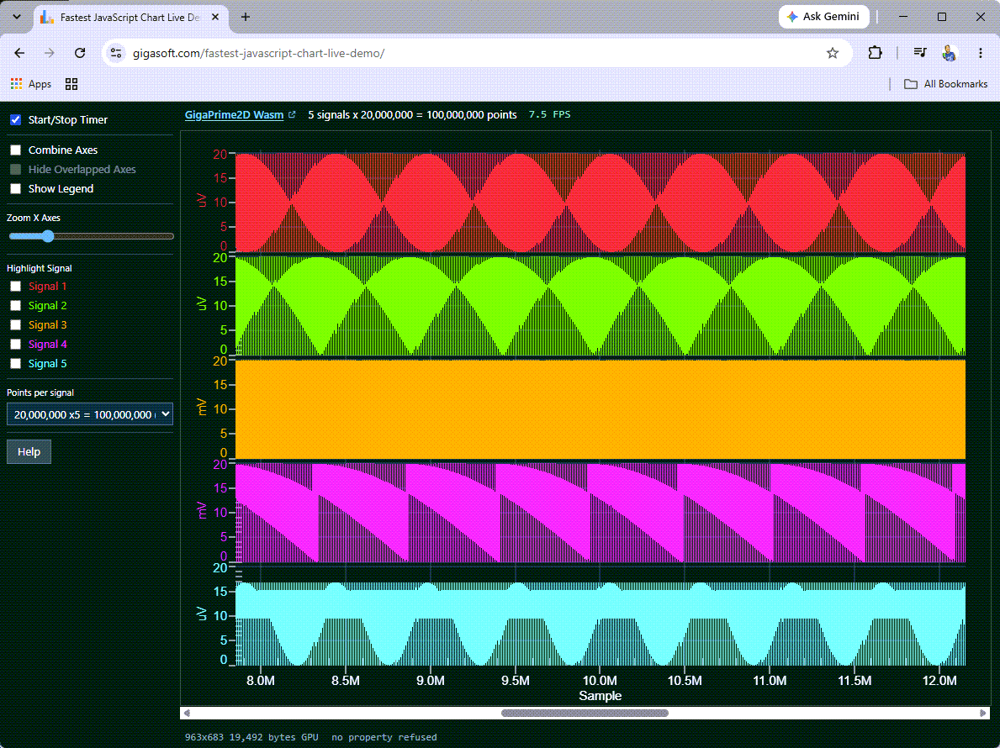

# GigaPrime2D Wasm -- 100 Million Point JavaScript Chart

A ProEssentialsJS demonstration of WebGPU compute shader rendering -- 100 million
data points completely re-passed and re-rendered every frame, in a browser tab.
Live FPS displayed above the chart.

---




**See this repo live now in your browser: [click here](https://gigasoft.com/fastest-javascript-chart-live-demo/)**

If you like what you see, we'd appreciate a star -- it helps more
than you realize.

---

## What This Demonstrates

* **5 signals x 20,000,000 points = 100M data points per frame**

* **Live FPS** displayed beside the point count

* **A desktop engine, not a web library.** The same native C++ engine
  Gigasoft has shipped since 1995 -- running inside instrumentation, SCADA,
  medical and test-and-measurement products -- compiled to WebAssembly.
* **The JavaScript property names are the WinForms property names.** If you
  have used ProEssentials on the desktop, you already know the API. AI assisted
  with our pe_query.py Ai-Data repo for ground truth intelligence based on
  our WinForms.
* **Compute shaders feeding compute shaders, and a zero-copy path.** The chart
  is handed a pointer into the WebAssembly heap, and GPU stages consume each
  other's output without returning to the CPU. This is full-data-replacement
  work: large line data, 3D surfaces, 2D contours, where the whole dataset
  changes every frame. A charting engine designed by electrical engineers,
  engineered to the nth degree. ProEssentialsJS is not just faster, it's
  magnitudes faster.
* **No WebGL context limit.** Canvas2D is not a GPU context, so putting many
  charts on one page does not run into the browser's cap. The GPU is engaged
  where the chart needs it.
* **Free for commercial use under USD 250,000 revenue**, redistribution
  included. No licence key, no activation, no domain lock, no phone home, no
  watermark.

---

## Measured Performance

Measured on an RTX 3090, resolution independent. Your numbers will differ
with GPU, APU, or Integrated Graphics. Help us out, post your fps speeds
on social media.

| Points per frame | FPS |
|---|---|
| 100,000,000 | 7 |
| 50,000,000 | 13.5 |
| 25,000,000 | 25 |
| 5,000,000 | 65 |
| 2,000,000 | 112 |
| 1,000,000 | 125 |
| 400,000 | 145 |

The point count is a dropdown in the demo, so every row above is one click
apart. The largest sizes allocate hundreds of megabytes in the WebAssembly
heap; if that allocation fails the demo falls back to the previous size and
keeps drawing rather than dying.

---

## How It Works

### Data architecture

A point pool is prepared once at startup. Each frame, a slice is copied from a
random offset in the pool into the active buffer, and the chart is handed a
**pointer** to that buffer rather than the data itself. `PeData.X.allocate()`
and `PeData.Y.allocate()` reserve the buffers inside the WebAssembly heap;
`useDataAtLocation()` gives the engine their addresses.

The X array is shared across all five signals rather than duplicated, because
the samples are equally spaced -- five signals cost one X array, not five.

This is full data replacement, not a static render. Plotting a fixed dataset
quickly is a different and much easier problem: the buffer here changes every
frame and the chart is rebuilt from it every frame.

### Compute shaders feeding compute shaders

Scene construction runs on the GPU. The output of one compute stage is consumed
by the next without returning to the CPU, and the vertex data never leaves GPU
memory between stages. Most JavaScript charting libraries decimate on the CPU by
default, with a GPU path available only for particular series types.

### Five independent axes

Each signal gets its own Y axis lane through `MultiAxesSubsets`. The controls
combine them, hide the overlapped labels, highlight one channel, or resize the
lanes interactively.

---

## Interactive Controls

- **Start/Stop Timer** -- begins continuous re-rendering
- **Points per signal** -- the dropdown, 400,000 through 20,000,000
- **Mouse wheel** -- zooms the X axis range
- **Zoom X Axes slider** -- programmatic zoom
- **Combine Axes** -- overlaps all five signals into one graph area
- **Hide Overlapped Axes** -- collapses to a single combined Y axis label
- **Highlight Signal 1-5** -- expands the selected channel
- **Show Legend** -- toggles the legend
- **Right-click** -- the full built-in context menu, including zoom reset

---

## How to Run

```
git clone https://github.com/GigasoftInc/proessentials-js-gigaprime2d.git
cd proessentials-js-gigaprime2d
npm start
```

Then open the address it prints.

**Nothing to install.** The server is one file with no dependencies, and the
library is committed to this repository -- `npm start` needs no network.

A dedicated GPU is recommended for the larger point counts. **WebGPU needs a
secure context**: `http://localhost` is one, a LAN address like
`http://192.168.1.10` is not, and `navigator.gpu` is simply undefined there. The
chart still draws through Canvas2D, so that failure is quiet and looks like a
driver problem.

---

## What a page needs

Two tags:

```html
<script src="lib/proessentials.iife.js"></script>
<script type="module" src="app.js"></script>
```

The first is the whole runtime -- engine, control, menus, scrollbars, tooltips,
dialogs and the 3D/WebGPU layer. The second is the application, which imports
the one facade it needs as an ordinary ES module. `app.js` is the entire demo.

Editor intellisense works with no configuration; the facade declaration
references the rest, so there is no `jsconfig.json` to write.

---

## npm

The same library is on npm:

```
npm install proessentials
```

## Where to go next

| | |
|---|---|
| start here | [proessentials-js-starter](https://github.com/GigasoftInc/proessentials-js-starter) -- the smallest chart, the file to read first |
| every example | [proessentials-js-demo](https://github.com/GigasoftInc/proessentials-js-demo) -- 120 examples with the source beside each |
| large data | [proessentials-js-gigaprime2d](https://github.com/GigasoftInc/proessentials-js-gigaprime2d) -- millions of points, replaced every frame |
| 3D | [proessentials-js-gigaprime3d](https://github.com/GigasoftInc/proessentials-js-gigaprime3d) -- surfaces and contours on WebGPU |
| your AI | [proessentials-ai-data](https://github.com/GigasoftInc/proessentials-ai-data) -- ground truth for an AI assistant: property paths, enums, 116 examples |
| the product | <https://gigasoft.com> -- documentation, pricing, the walkthrough |

## Licence and support

**Free for commercial use, including redistribution, by organizations under
USD 250,000 annual gross revenue** -- no watermark, no feature gates, no
expiry. Above that, prices are published through to the largest buyer; a licence
is perpetual, paid once and royalty free.

See [PEJS-LICENSE.md](PEJS-LICENSE.md), [THIRD-PARTY-NOTICES.md](THIRD-PARTY-NOTICES.md)
and <https://gigasoft.com/license>.

**Support is free and unlimited, answered by the people who wrote the engine:
<https://gigasoft.com/contact>.** Issues are turned off on this repository
so that every question reaches somebody who can answer it.
